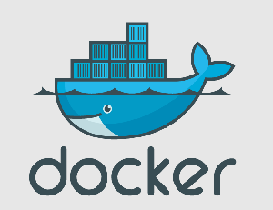
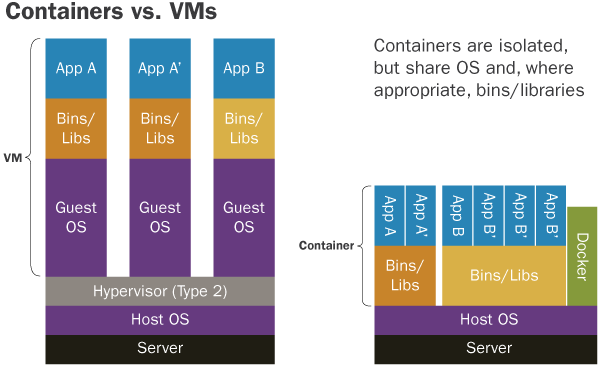
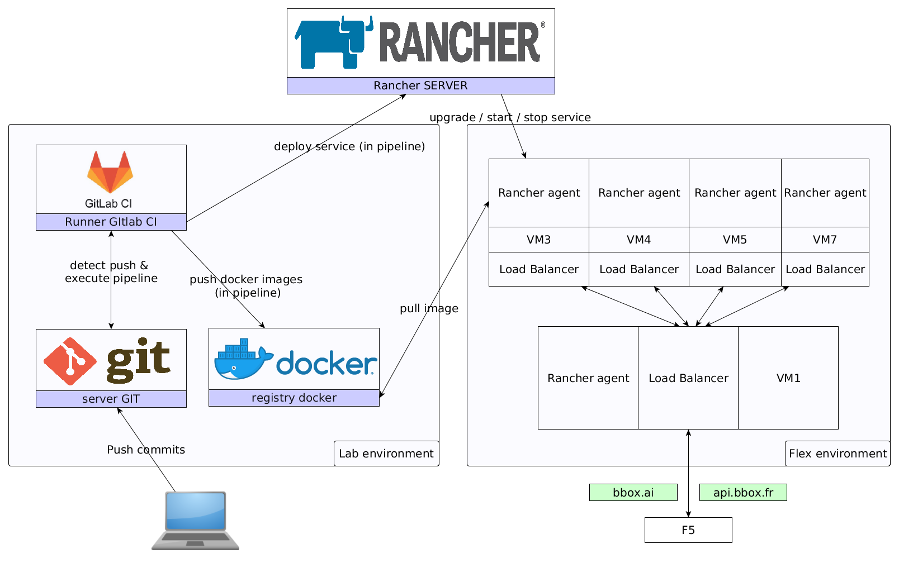

## CI/CD using   Rancher & Gitlab

  

    
  
  
  

    
  

---

> Docker is an open platform for developing, shipping, and running applications

Note:
Docker allows you to package an application with all of its dependencies into a standardized unit for software development.

---

## VM vs Docker

Note:
Sandbox environment (develop, test, debug, educate), 
Continuous Integration & Deployment, 
Scaling apps, 
Development collaboration, 
Infrastructure configuration, 
Local development, 
Multi-tier applications, 
PaaS, SaaS, 

---

## GitLab

- VCS
- Continuous Integration (Gitlab CI)
- Docker registry
- User / Group management

---

## Rancher

- Docker container management
- Distinct environments (Labo, Prod ...)
- Supported hosts : custom, Amazon, Azure ...
- User management per environment

---

#### CI/CD flow (simplified)

---

## Demo